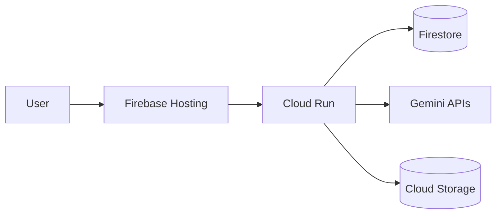

## Summary

-

## Infrastructure Diagram

## Deployment Notes

-

## Test Results

- [ ] `npm run lint`
- [ ] `npm run typecheck`
- [ ] `npm run test`
- [ ] `npm run security:scan`
- [ ] `npm run build`
- [ ] Smoke tests

## Security Considerations

-

## Rollback Strategy

-
