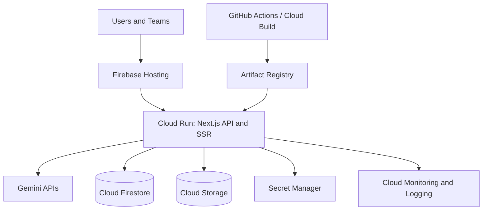

# Infrastructure Guide

## Target Architecture

## Compute

Cloud Run hosts the standalone Next.js server and API routes. Logical services are split by route and can be separated into dedicated services later if latency, cost, or ownership requires it:

| Capability | Routes | Scale Signal |
| --- | --- | --- |
| API layer | `/api/*` | request concurrency |
| Agent orchestration | `/api/intelligence`, `/api/research`, `/api/outreach` | workflow latency and Gemini latency |
| Analytics | `/api/admin/data`, dashboard pages | Firestore read latency |
| Exports | `/api/proposals/export` | CPU and storage write latency |

## Data

Firestore stores tenants, workspaces, workflows, activity, and analytics. Cloud Storage stores exports and larger generated artifacts. Both resources use organization/workspace scoping and IAM-backed service access.

## Security

- Runtime secrets are injected from Secret Manager.
- Server-only values never use the `NEXT_PUBLIC_` prefix.
- Security headers are applied in `next.config.ts` and Firebase Hosting.
- Firestore and Storage rules enforce tenant isolation.
- GitHub Actions uses OIDC instead of long-lived Google Cloud keys.

## Observability

Required Cloud Monitoring dashboards:

- API p50/p95/p99 latency
- 4xx/5xx response rates
- Agent workflow failures
- Gemini request latency and failure rate
- Firestore read/write latency
- Cloud Run instance count and container memory

Recommended alerts:

- 5xx rate greater than 2% for 5 minutes
- p95 API latency greater than 2 seconds for 10 minutes
- p95 workflow latency greater than 10 seconds for 10 minutes
- Gemini failures greater than 5% for 5 minutes
- Cloud Run memory above 85% for 10 minutes
