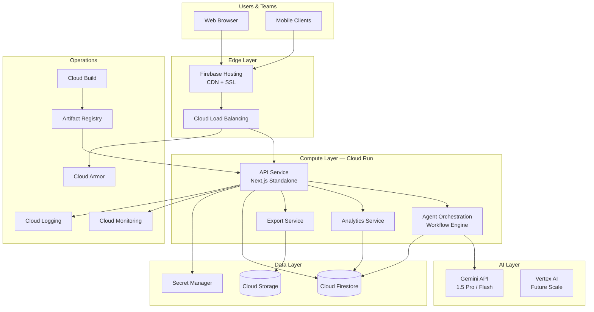
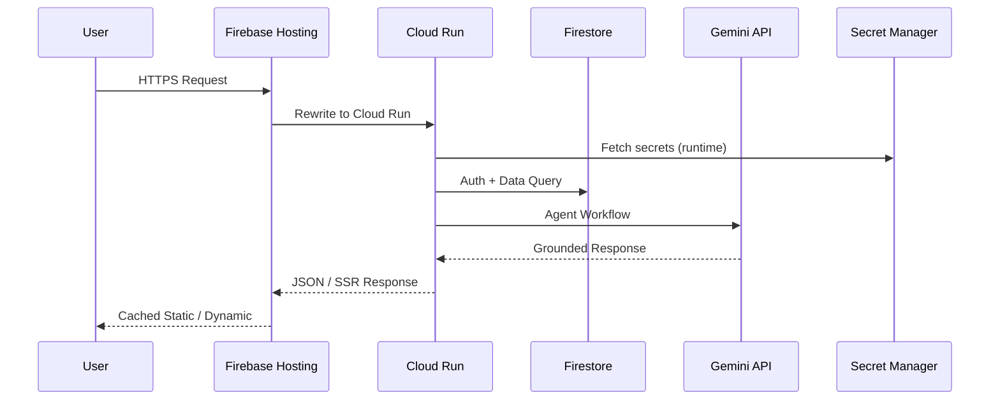
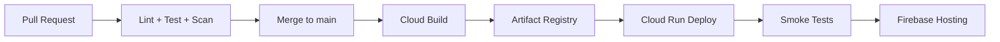

# Google Cloud Architecture — Sales Intelligence Platform

## Overview

The Autonomous B2B Sales Intelligence Agent platform runs on Google Cloud with a serverless, auto-scaling architecture designed for production SaaS workloads.

## Architecture Diagram

## Request Flow

## Environment Separation

| Environment | Project ID | Min Instances | Max Instances | Memory | CPU |
|-------------|-----------|---------------|---------------|--------|-----|
| Development | `sales-intelligence-dev` | 0 | 5 | 512Mi | 1 |
| Staging | `sales-intelligence-staging` | 1 | 20 | 1Gi | 2 |
| Production | `sales-intelligence-prod` | 2 | 100 | 2Gi | 4 |

## Service Topology

### Cloud Run Services

All services share the same container image with route-based separation:

| Service | Routes | Purpose |
|---------|--------|---------|
| API Layer | `/api/*` | REST API, auth, CRUD |
| Agent Orchestration | `/api/intelligence`, `/api/research`, `/api/outreach` | Multi-agent workflows |
| Analytics | `/api/admin/data`, dashboard metrics | Executive dashboards |
| Export | `/api/proposals/export` | Document generation |

### Firebase Hosting

- Serves static assets with immutable cache headers (1 year)
- Rewrites all dynamic traffic to Cloud Run
- Security headers enforced at edge

### Firestore

- Multi-tenant data isolation via organization/workspace scoping
- Composite indexes for analytics queries
- Security rules enforce RBAC at database layer

### Cloud Storage

- Organization-scoped file storage
- Export artifacts (proposals, reports)
- 10MB upload limit per object

## Secret Management

Secrets are stored in **Google Secret Manager** and injected at runtime:

| Secret | Purpose |
|--------|---------|
| `gemini-api-key-{env}` | Gemini API authentication |
| `firebase-private-key-{env}` | Firebase Admin SDK |
| `firebase-client-email-{env}` | Service account email |

Public Firebase config (`NEXT_PUBLIC_*`) is set as Cloud Run environment variables during deployment.

## Network & Security

- TLS termination at Firebase Hosting / Cloud Run
- IAM service accounts per environment
- Secret Manager access via `roles/secretmanager.secretAccessor`
- Firestore security rules + API RBAC middleware
- Cloud Armor (production) for DDoS protection

## Auto Scaling

Cloud Run scales based on:
- Concurrent requests (target: 100 per instance)
- CPU utilization
- Request queue depth

Production maintains minimum 2 instances for warm starts and sub-2s dashboard latency.

## Deployment Pipeline

## Rollback Strategy

1. **Cloud Run**: `gcloud run services update-traffic --to-revisions=PREVIOUS=100`
2. **Container**: Redeploy previous image tag from Artifact Registry
3. **Firebase Hosting**: `firebase hosting:rollback`
4. **Firestore**: Point-in-time recovery from automated backups

## Related Documentation

- [Deployment Guide](../deployment-guide.md)
- [Infrastructure Guide](../infrastructure-guide.md)
- [Operations Runbook](../operations-runbook.md)
